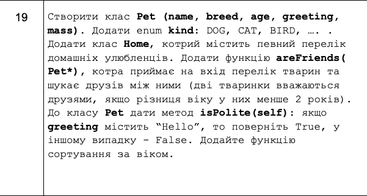

## Лабораторні роботи з дисципліни "Алгоритмізація та програмування"
## Виконав: Попов Юрій Андрійович(ІР-13)
## Лабораторна робота №5 (Варіант 19)
### Завдання:
    Написати програму алгоритмічною мовою Python згідно з завданням, отриманим від викладача за табл. 1. 
    Додайте відповідні конструктори, деструктори, функції доступу та виведення інформації на екран. 
    У методі main продемонструйте роботу класів.

